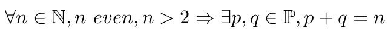

<p align="center">
	
</p>

<h1 align="center">Goldbach Conjecture</h1>

<p align="center">
	<strong>Explore Goldbach's conjecture!</strong>
</p>

## 🚀 Overview

Welcome to **Goldbach Conjecture**! Goldbach's Conjecture theorizes that `every even integer greater than 2 can be expressed as the sum of two prime numbers`.  
  
In mathematical notation, this can be expressed as:  
$$\forall n \in \mathbb{N}, n \ even, n > 2 \Rightarrow \exists p, q \in \mathbb{P}, p + q = n$$

> [!NOTE]
> The following command will show the manual for the program: `man ./goldbach_conjecture.1`.

## 🎨 Features

- **Input:** Number input can be given in scientific notation form.

## 🛠️ Installation

To get started with the program, follow the steps below:

1. **Clone the Repository**
```sh
git clone https://github.com/321BadgerCode/goldbach_conjecture.git
cd ./goldbach_conjecture/
```

2. **Compile the Program**
```sh
g++ ./main.cpp -o ./goldbach_conjecture
```

## 📈 Usage

To use the program, there is only **one** step!

1. **Run the program**
```sh
./goldbach_conjecture [options]
```

<details>

<summary>💻 Command Line Arguments</summary>

**Command Line Arguments**:
|	**Argument**		|	**Description**	|	**Default**	|
|	:---:			|	:---:		|	:---:		|
|	`-h & --help`		|	Help menu	|			|
|	`--version`		|	Version number	|			|
|	`-n`			|	Number		|	`random`		|

</details>

## 📜 License

[LICENSE](./LICENSE)